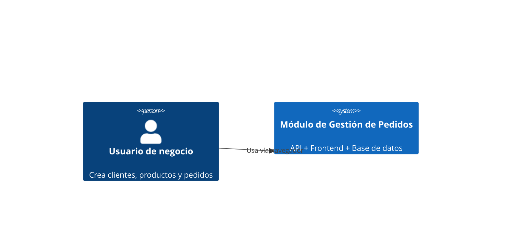
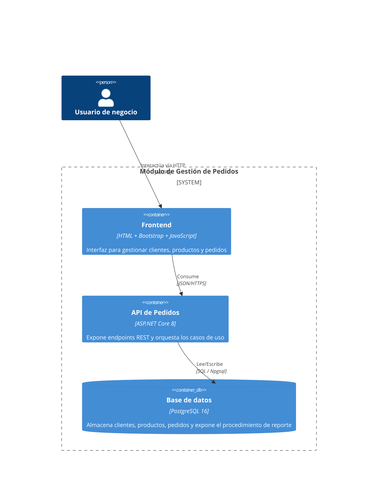
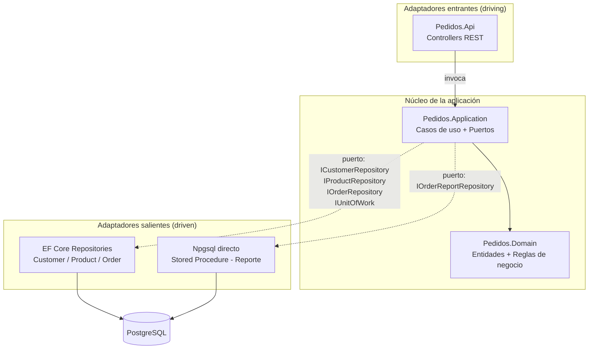

# Arquitectura — Módulo de Gestión de Pedidos

## Diagrama de contexto (C4 — Nivel 1)

## Diagrama de contenedores (C4 — Nivel 2)

## Arquitectura hexagonal (puertos y adaptadores)

**Regla de dependencia**: las flechas de compilación siempre apuntan hacia adentro. `Pedidos.Domain` no conoce a nadie. `Pedidos.Application` sólo conoce a `Pedidos.Domain` y define los puertos (interfaces) que necesita, sin saber quién los implementa. `Pedidos.Infrastructure` implementa esos puertos usando EF Core y Npgsql. `Pedidos.Api` es el único proyecto que conoce ambos lados y realiza el cableado de inyección de dependencias en `Program.cs`.

**Entidades desacopladas del ORM**: las clases en `Pedidos.Domain` son POCOs puros, sin atributos ni referencias a Entity Framework. El mapeo objeto-relacional vive exclusivamente en `Pedidos.Infrastructure/Persistence/Configurations` mediante Fluent API.

## Caso de uso principal: crear pedido

1. `OrdersController` recibe la solicitud y la delega a `IOrderService`.
2. `OrderService` (Application) valida que el cliente exista, que los productos existan y tengan stock suficiente.
3. Las reglas de negocio (reservar stock, calcular subtotales, invariantes de estado) viven en las entidades `Order` y `Product` (Domain).
4. `OrderService` pide a los repositorios (puertos) persistir los cambios; `Pedidos.Infrastructure` los traduce a SQL vía EF Core dentro de una única unidad de trabajo (`IUnitOfWork`).

## Reporte con procedimiento almacenado

El resumen de pedidos por cliente (`GET /api/orders/reports/customer/{id}`) no se resuelve con EF Core: `Pedidos.Application` define el puerto `IOrderReportRepository`, y `Pedidos.Infrastructure.Reporting.OrderReportRepository` lo implementa invocando directamente, vía Npgsql, la función almacenada `get_customer_order_summary` (`database/init/02_stored_procedure.sql`). Esto demuestra el uso real de un procedimiento almacenado dentro de la arquitectura hexagonal, sin acoplar el núcleo de la aplicación a PostgreSQL.

## Modelo de datos

| Tabla | Descripción | Índices |
|---|---|---|
| `customers` | Clientes | único en `email` |
| `products` | Catálogo de productos | PK |
| `orders` | Pedidos | `customer_id`, `order_date` |
| `order_items` | Detalle de cada pedido | `order_id`, `product_id` |

Ver definición completa en `database/init/01_schema.sql`.
